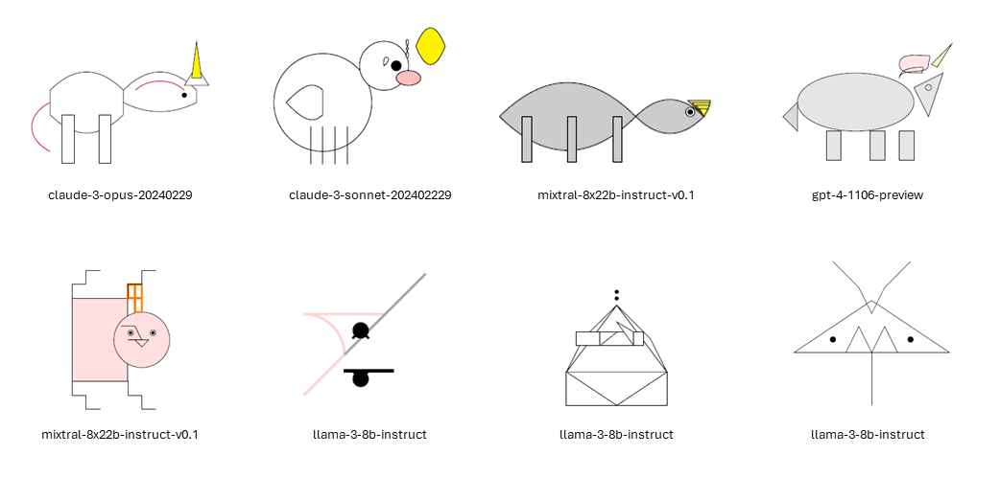

# Unicorn-Test

This repository compiles results of the unicorn test for various open-weights models.

This is not a good test. It is not even meant to be a good test.

However: Nobody is gaming it deliberately, because it is too silly. So it might be a better test than alternatives.

## Rules
1) We only care about whether it can draw TikZ.
2) We don't care what the model says to us that isn't TikZ code
3) We always use exactly the prompt "Draw a unicorn in TikZ".

## process_tex.py

Run `process_tex.py` to generate a pdf. The file will take the tex files in [\drawings](\drawings), combine them with `head.tex` and `footer.tex`, and use `pdflatex` to create a .pdf.


```
python file_to_compile.tex
```

## Best of

Below are some unicorns produced by leading LLMs. Top row are the best. Bottom row is the worst.

<br>
<br>

